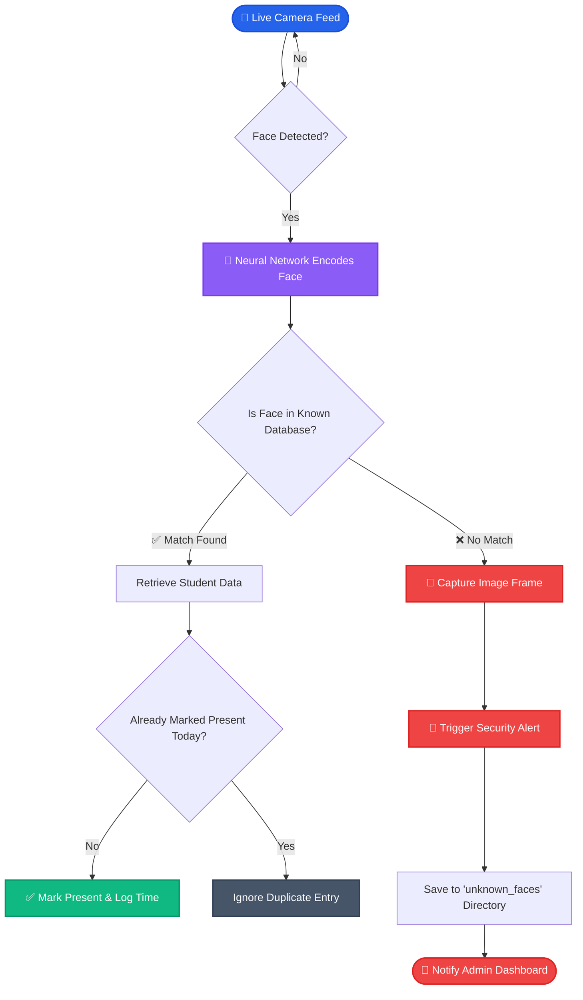

<div align="center">
  
</div>

<h1 align="center">VisioMark 👁️🎯</h1>

<p align="center">
  <strong>An advanced Face Recognition system built with React, Node.js, and Python Computer Vision.</strong><br>
  VisioMark automates student attendance tracking while providing real-time security breach alerts for unauthorized access.
</p>

<div align="center">
  
  
  
  
  
</div>

---

## 🌟 Key Features

- ⚡ **Lightning Fast Scanning:** Utilizes optimized Python/Flask microservices for real-time `cv2` and `dlib` face encoding.
- ✅ **Automated Attendance:** Identifies registered students and logs their entry times seamlessly.
- 🚨 **Security Breach Detection:** Automatically detects unknown faces, captures an instant snapshot, and triggers a high-priority dashboard alert.
- 🎨 **Corporate Animated UI:** A beautiful, responsive, and fluid dashboard built with Tailwind CSS and Framer Motion.
- 🧑‍🎓 **Incident Management:** Instantly identify and convert "unknown" intruders into registered students directly from the alerts panel.

---

## ⚙️ Architecture & Data Flow 🔄

Below is the automated lifecycle of how a face is processed when captured by the live camera feed:



---

## 🚀 How to Run Locally

### 1. Prerequisites
Ensure you have the following installed:
- Node.js (v16+)
- Python (v3.9 - v3.11)
- CMake & C++ Build Tools (Required for `dlib` & `face_recognition`)

### 2. Install Dependencies

**Frontend:**
```bash
cd frontend
npm install
```

**Backend (Node.js API):**
```bash
npm install
```

**Python (Scanner API):**
```bash
# Downgrade setuptools to avoid pkg_resources error with face_recognition
pip install setuptools==69.5.1
pip install face_recognition opencv-python flask flask-cors
```

### 3. Start the Application
You will need three terminal windows to run the microservices concurrently:

**Terminal 1: Node.js Backend Server**
```bash
node server.js
```

**Terminal 2: Python Fast Scanner API**
```bash
python fast_scanner_api.py
```

**Terminal 3: React Frontend**
```bash
cd frontend
npm run dev
```

---
<div align="center">
  <i>Engineered for Security, Optimized for Speed.</i>
</div>
